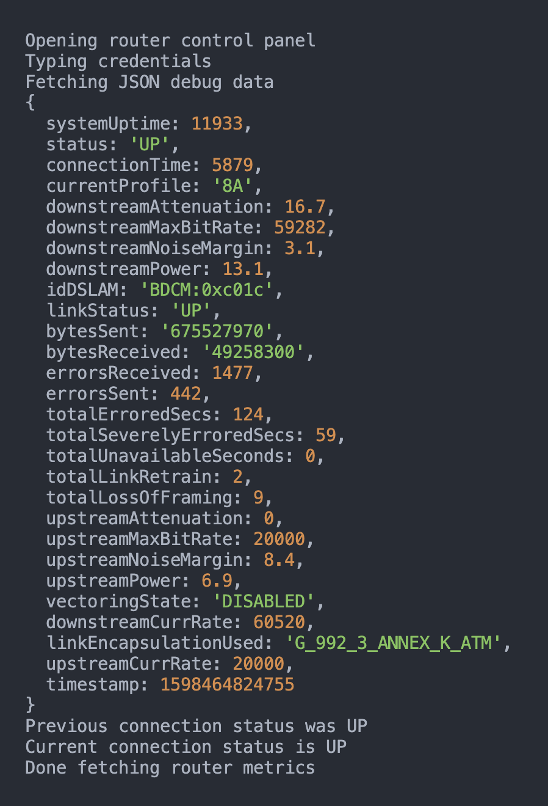

# Network Monitor Bot



A simple bot that periodically hits the admin panel for my [TalkTalk](http://talktalk.co.uk/)
SG4K10001400t VDSL router and scrapes the broadband WAN metrics.

Those metrics are logged to a file as seperate rows of JSON. In the future I'd like to
ingest these metrics and visualise them in Grafana.

## Requirements

The only requirements of this application are Node.js and Yarn. All others can be installed with:

`yarn install`

## Running The Application Locally

Run the script from a computer on your local network:

`ADMIN_PASSWORD=YOUR_ROUTER_ADMIN_PASSWORD_HERE yarn start`

## Archived Metrics

Every time the script runs a new line is appended to a `metrics.log` file in the current directory.

You could parse this file however you want, perhaps using the excellent [jq](https://stedolan.github.io/jq/) utility.

```json
{"systemUptime":"14h32m52s","status":"UP","connectionTime":"05h33m36s","linkStatus":"UP","standard":"VDSL2 (G_993_2_ANNEX_ B) ","lineEncoding":"DMT","linkEncapsulation":"ATM (G_992_3_ANNEX_ K_ATM)","actualRateDown":"47984","actualRateUp":"20000","maximumRateDown":"54429","maximumRateUp":"20000","noiseMarginDown":"0.00","noiseMarginUp":"6.00","attenuationDown":"16.50","attenuationUp":"0.00","powerDown":"13.10","powerUp":"6.80","timestamp":1597272076429}
{"systemUptime":"14h33m04s","status":"DOWN","connectionTime":"05h33m48s","linkStatus":"UP","standard":"VDSL2 (G_993_2_ANNEX_ B) ","lineEncoding":"DMT","linkEncapsulation":"ATM (G_992_3_ANNEX_ K_ATM)","actualRateDown":"47984","actualRateUp":"20000","maximumRateDown":"54429","maximumRateUp":"20000","noiseMarginDown":"0.00","noiseMarginUp":"6.00","attenuationDown":"16.50","attenuationUp":"0.00","powerDown":"13.10","powerUp":"6.80","timestamp":1597272087700}
{"systemUptime":"14h33m21s","status":"UP","connectionTime":"05h34m05s","linkStatus":"UP","standard":"VDSL2 (G_993_2_ANNEX_ B) ","lineEncoding":"DMT","linkEncapsulation":"ATM (G_992_3_ANNEX_ K_ATM)","actualRateDown":"47984","actualRateUp":"20000","maximumRateDown":"54429","maximumRateUp":"20000","noiseMarginDown":"0.00","noiseMarginUp":"6.00","attenuationDown":"16.50","attenuationUp":"0.00","powerDown":"13.10","powerUp":"6.80","timestamp":1597272105107}
```

## Deployment

I have the script running periodically using a `systemd` timer. The following config files make that happen.

[Healthchecks.io](https://healthchecks.io) is a nice way to be notified if scheduled tasks stop running. I
fire a request to their ping endpoint using `curl` each time the bot runs. If it stops reporting in for more than an hour
I get sent an email.

```
# /etc/systemd/system/network-monitor-bot.service

[Unit]
Description=A bot to periodically log my TalkTalk router metrics

[Service]
Type=oneshot
User=pi
WorkingDirectory=/home/pi/network-monitor-bot
ExecStart=/usr/bin/yarn start
ExecStartPost=curl -fsS --retry 3 https://hc-ping.com/PING_ID_GOES_HERE
```

```
# /etc/systemd/system/network-monitor-bot.timer

[Unit]
Description=Run network-monitor-bot hourly

[Timer]
OnCalendar=*:15,45
RandomizedDelaySec=60

[Install]
WantedBy=timers.target
```

```
# /etc/systemd/system/network-monitor-bot.service.d/override.conf

[Service]
Environment="NATIVE_CHROMIUM=true"
Environment="ADMIN_PASSWORD=YOUR_ROUTER_ADMIN_PASSWORD_HERE"
```

Don't forget to reload `systemd` after creating these config files:

`sudo systemctl daemon-reload`

## License

Released under the [MIT License](https://opensource.org/licenses/MIT).
